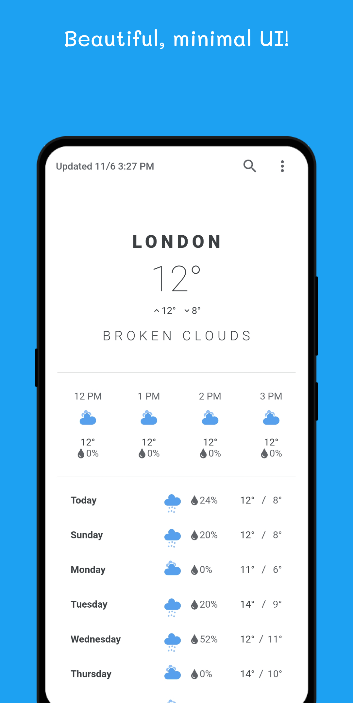
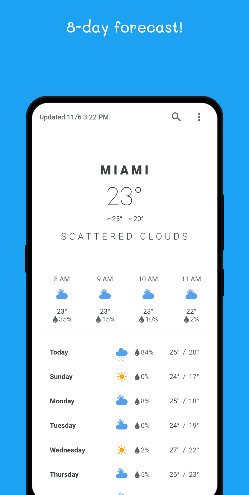
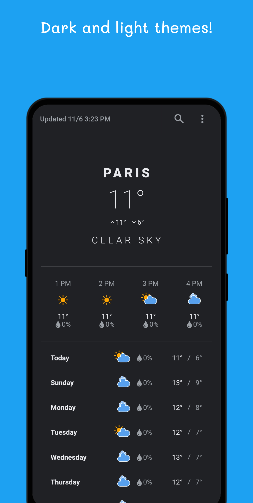
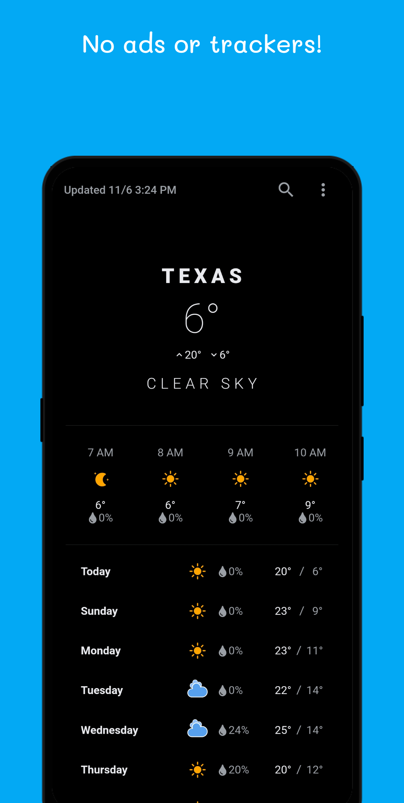

# Clima ☁

Beautiful, minimal, and fast weather app. (Requires Android 6.0 or later)

   

## Features

- :white_check_mark: Beautiful, minimal UI
- :white_check_mark: 8-day forecast
- :white_check_mark: Imperial units support
- :white_check_mark: Dark and light themes
- :white_check_mark: No ads or trackers

## Download

Download [here](https://github.com/PrestoSole/clima/releases) or get it on `F-droid`

## Donations

<noscript> </noscript> 

## Special Thanks

Special thanks to [Mohammed Anas](https://github.com/mhmdanas), without whom Clima would never be what it is today.

## Credits

* The app's weather data is provided by [OpenWeather](https://openweathermap.org).
* The app logo's [icon](https://www.iconfinder.com/iconsets/tiny-weather-1) is designed by [Paolo Spot Valzania](https://linktr.ee/paolospotvalzania), licensed under the [CC BY 3.0](https://creativecommons.org/licenses/by/3.0/) / Placed on top of a light blue background.
* The [weather icons](https://www.amcharts.com/free-animated-svg-weather-icons/) used inside the app are designed by [amCharts](https://www.amcharts.com) and licensed under the [CC BY 4.0](https://creativecommons.org/licenses/by/4.0/).
