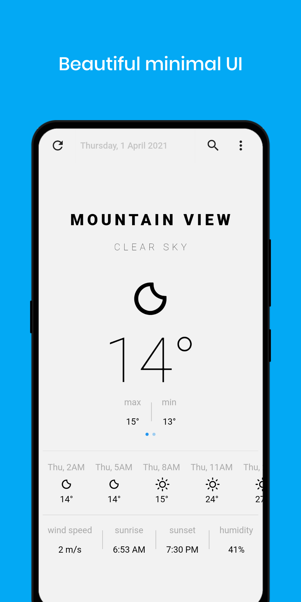
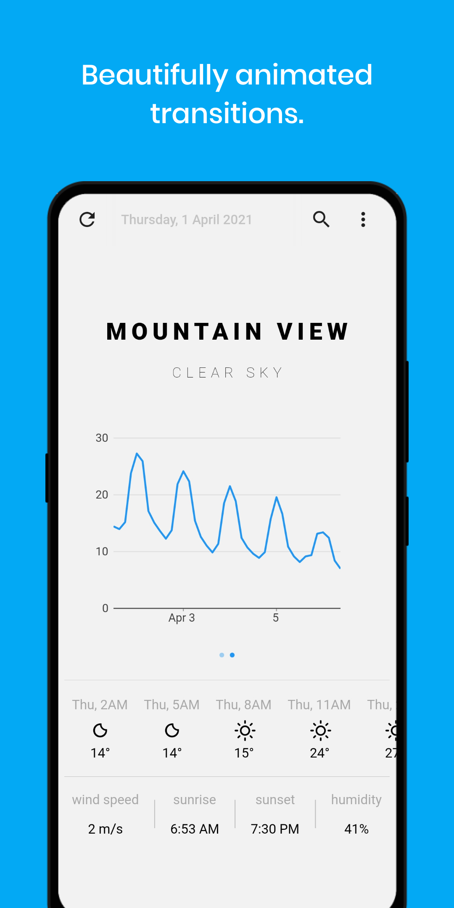
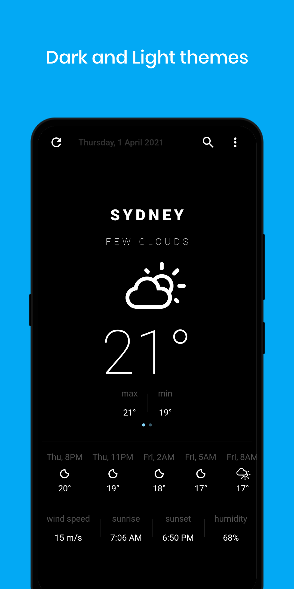
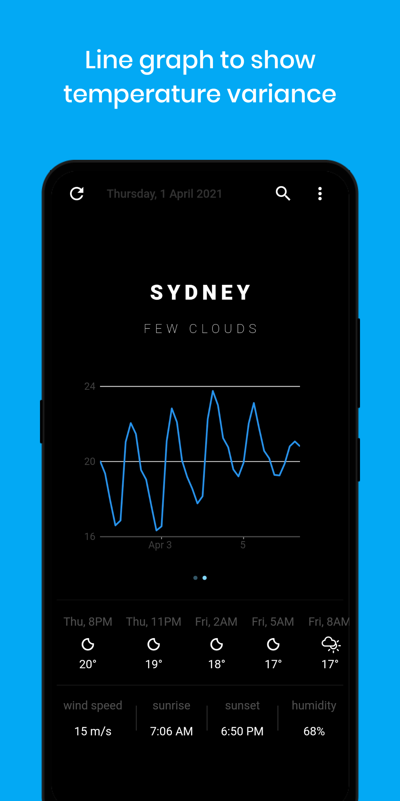

# Clima ☁

A simple and fast weather app. (Requires Android 6.0 or later)

 

 

## Features
- :white_check_mark: Beautiful minimal UI
- :white_check_mark: Dark and Light themes
- :white_check_mark: 5 day forecast
- :white_check_mark: Beautifully animated transitions
- :white_check_mark: Line graph to show temperature variance

## Download

Download [here](https://github.com/PrestoSole/clima/releases) or get it on `F-droid`

## Credits

* The logo's icon is designed by Alessio Atzeni and made freely at http://www.alessioatzeni.com/meteocons/
* The App design is heavily inspired by https://github.com/LonelyCpp/flutter_weather
* All the packages in `packages` except for `clima_ui` were created from templates made available by Stagehand under a BSD-style [license](https://github.com/dart-lang/stagehand/blob/master/LICENSE).
