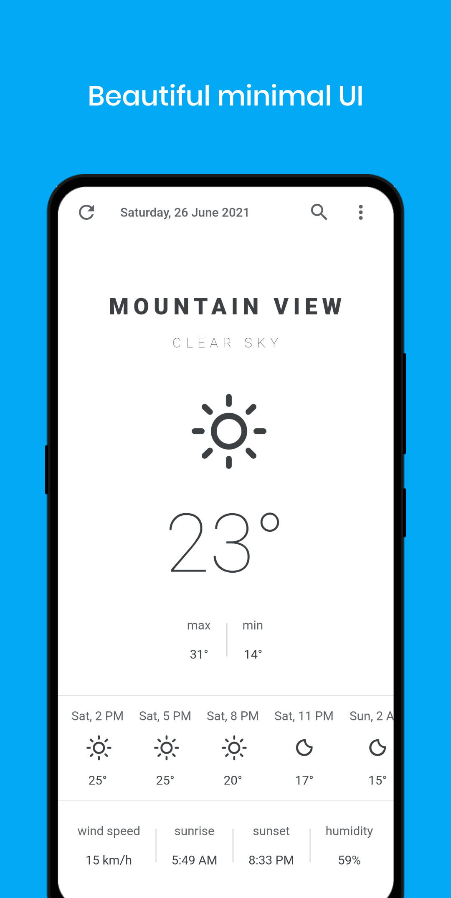
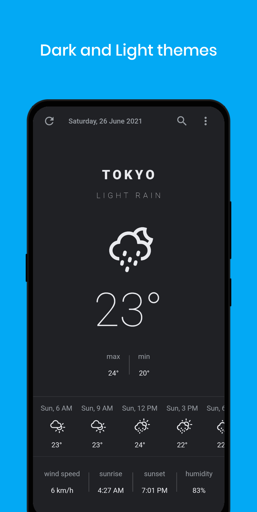
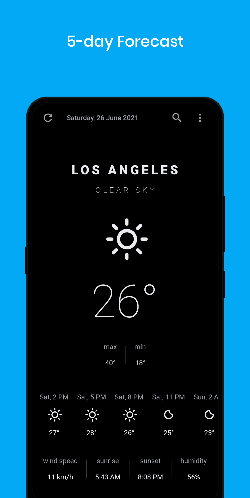

# Clima ☁

Beautiful, minimal, and fast weather app. (Requires Android 6.0 or later)

  

## Features

- :white_check_mark: Beautiful minimal UI
- :white_check_mark: Dark and Light themes
- :white_check_mark: 5 day forecast

## Download

Download [here](https://github.com/PrestoSole/clima/releases) or get it on `F-droid`

## Credits

* The logo's icon is designed by [Paolo Spot Valzania](https://linktr.e/paolospotvalzania), licensed under the [CC BY 3.0](https://creativecommons.org/licenses/by/3.0/), and made available free of charge on [IconFinder](https://www.iconfinder.com/iconsets/tiny-weather-1)
* The App design is heavily inspired by https://github.com/LonelyCpp/flutter_weather
* All the packages in `packages` except for `clima_ui` were created from templates made available by Stagehand under a BSD-style [license](https://github.com/dart-lang/stagehand/blob/master/LICENSE).

## License

Clima is free software: you can redistribute it and/or modify
it under the terms of the GNU General Public License as published by
the Free Software Foundation, either version 3 of the License, or
(at your option) any later version.

Clima is distributed in the hope that it will be useful,
but WITHOUT ANY WARRANTY; without even the implied warranty of
MERCHANTABILITY or FITNESS FOR A PARTICULAR PURPOSE.  See the
GNU General Public License for more details.
